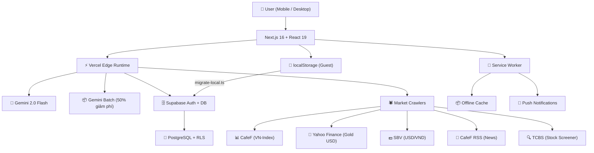

# VietFi Advisor — Cố Vấn Tài Chính AI Cho Người Việt

<!-- ALL BADGES -->
<div align="center">

[](https://nextjs.org/)
[](https://react.dev/)
[](https://ai.google.dev/)
[](https://tailwindcss.com/)
[](https://supabase.com/)
[](https://www.typescriptlang.org/)
[](https://vitest.dev/)
[](https://playwright.dev/)
[](LICENSE)
[](#)

**AI tài chính · Gamification · Thị trường thời gian thực · Tiếng Việt**

Vẹt Vàng — con vẹt vàng thông minh nhất Việt Nam 🦜💛

[🚀 Live Demo](https://vietfi-advisor.vercel.app) · [📋 Phân công](./WDA2026_PHAN_CONG.md) · [🐛 Báo lỗi](https://github.com/hungpixi/vietfi-advisor/issues) · [📂 CLAUDE.md](./CLAUDE.md)

</div>

---

## Part I — The Pitch

### Vấn Đề

Người trẻ Việt Nam thiếu công cụ quản lý tài chính phù hợp. Các app nước ngoài không hiểu context VN (vàng SJC, lãi suất huy động, trả góp, VN-Index...) và các app nội địa thì rời rạc, thiếu AI.

### Giải Pháp

**VietFi Advisor = Duolingo + Mint + ChatGPT cho tài chính Việt Nam.**

Vẹt Vàng — mascot xoắc quắt, mổ tiêu xài dở — biến thói quen tài chính thành game.

### WDA2026 Alignment

| Problem       | Mô tả                                                                             |
| ------------- | --------------------------------------------------------------------------------- |
| **Problem 1** | Centralized Debt Hub — trung tâm nợ tập trung với AI Snowball/Avalanche optimizer |
| **Problem 2** | AI Financial Advisor — Vẹt Vàng với 3-tier AI pipeline                            |
| **Problem 3** | Gamification — XP/level system biến quản lý tiền thành thói quen                  |
| **Problem 4** | Vietnamese Context — Vàng SJC, VN-Index, USD/VND, lãi suất Sacombank/Eximbank     |

### Tính Năng Chính

|                     |                                                                             |     |     |
| ------------------- | --------------------------------------------------------------------------- | --- | --- |
| 🦜 **Vẹt Vàng AI**  | Chat streaming với Gemini 2.0, voice input/output tiếng Việt, 4 mood states |     |     |
| 🎮 **Gamification** | XP, 5 levels (Vẹt Con → Vẹt Hoàng), streak, 8 badges, confetti, leaderboard |     |     |
| 📊 **Thị Trường**   | VN-Index, Vàng SJC, USD/VND, Fear & Greed Index — thời gian thực            |     |     |
| 🏦 **Debt Hub**     | DTI gauge, Snowball/Avalanche optimizer, timeline trả nợ                    |     |     |

### Quick Start

```bash
git clone https://github.com/hungpixi/vietfi-advisor.git
cd vietfi-advisor
npm install
cp .env.example .env.local   # add GOOGLE_GENERATIVE_AI_API_KEY (or GEMINI_API_KEY) + Supabase keys
npm run dev                   # http://localhost:3000
```

---

_Divider: Part II — Technical Documentation_

---

## Part II — Technical Documentation

### Kiến Trúc Hệ Thống



### AI Chat Pipeline (3-tier, tối ưu chi phí)

```
Tin nhắn user
    ↓
Tier 1: Regex expense parser ("phở 30k" → {item, amount, category}) — 0 API calls
    ↓ (không match)
Tier 2: Scripted responses (500+ canned, 25 intents, emoji-free TTS text)
    ↓ (không match)
Tier 3: Gemini streaming — Edge Runtime, 3-attempt retry, JSON output
```

> **Rule:** Khi thêm chat logic mới, thêm scripted responses TRƯỚC khi gọi Gemini.

### Data Flow

```
Guest user  →  localStorage (18 keys, server-safe)
              ↓ one-time migrate-local.ts
Logged-in   →  Supabase PostgreSQL + RLS
              ↓ useUserData.ts hooks
React UI    ←  useUserBudget, useUserDebts, useUserGamification
```

### Cấu Trúc Dự Án

```
vietfi-advisor/
├── src/
│   ├── app/
│   │   ├── api/                    # API routes (Edge Runtime)
│   │   │   ├── chat/              # Gemini streaming
│   │   │   ├── market-data/       # Live market data (VN-Index, Gold, USD)
│   │   │   ├── news/              # News + sentiment (CafeF RSS)
│   │   │   ├── morning-brief/     # AI morning brief
│   │   │   ├── stock-screener/    # VN stock filter (TCBS, VN30 fallback)
│   │   │   ├── tts/               # Edge TTS
│   │   │   ├── cron/              # Cron job handlers (market, brief, macro)
│   │   │   └── auth/              # Supabase auth
│   │   ├── dashboard/             # Dashboard pages (14 routes)
│   │   ├── login/                 # Auth page
│   │   ├── auth/                 # Email OTP confirmation
│   │   └── page.tsx             # Landing page
│   ├── components/
│   │   ├── vet-vang/              # 🦜 VetVangChat, VetVangFloat, AnimatedParrot
│   │   ├── gamification/          # 🎮 Badges, XPToast, Celebration, ShareCard
│   │   ├── debt/                  # 🏦 DTI gauge, optimizer timeline
│   │   ├── portfolio/             # 💎 GoldTracker, CashflowDNA
│   │   └── onboarding/            # 🚀 QuickSetupWizard
│   └── lib/
│       ├── calculations/           # ⚙️ Pure TS (no AI), fully testable
│       │   ├── debt-optimizer.ts # DTI, Snowball, Avalanche
│       │   ├── fg-index.ts        # Fear & Greed Index (VN)
│       │   ├── personal-cpi.ts    # Personal vs official CPI
│       │   └── risk-scoring.ts    # Prospect theory → risk profile
│       ├── market-data/           # 🕷️ Crawlers (CafeF, Yahoo, SBV, TCBS)
│       ├── news/                   # 📰 CafeF RSS + AI sentiment
│       ├── supabase/              # 🗄️ Auth SSR, user-data DAL, hooks
│       ├── gemini.ts              # 🤖 Streaming AI
│       ├── gemini-batch.ts        # 📦 Batch AI (50% cost)
│       ├── expense-parser.ts      # 💸 Regex → structured expense
│       ├── scripted-responses.ts  # 💬 500+ canned responses
│       ├── storage.ts             # 💾 18-key localStorage wrapper
│       ├── gamification.ts        # 🎮 XP, badges, levels
│       ├── rbac.ts               # 🔐 XP-threshold gates + promo code
│       ├── guru-personas.ts       # 🧙‍♂️ 5 AI mentor prompts
│       └── vetvang-persona.ts    # 🦜 Vẹt Vàng system prompt
├── public/
│   ├── animations/               # Lottie JSON (parrot)
│   ├── audio/tts/                # 72+ Vietnamese TTS MP3
│   └── assets/                   # Mascot images (5 levels)
├── scripts/
│   ├── generate-tts-bank.ts      # Generate all TTS files
│   └── generate_audio.py         # Voice clone pipeline
├── docs/                         # Project documentation
├── tests/
│   └── e2e/                      # Playwright E2E (landing, budget, onboarding)
├── vercel.json                   # Cron schedule + rewrites
├── vitest.config.ts
└── playwright.config.ts
```

### API Routes

| Method | Endpoint                  | Mô tả                                 | Auth          |
| ------ | ------------------------- | ------------------------------------- | ------------- |
| `POST` | `/api/chat`               | Gemini streaming chat (Vẹt Vàng)      | —             |
| `POST` | `/api/tts`                | Text-to-Speech (edge-tts-universal)   | —             |
| `GET`  | `/api/market-data`        | Live: VN-Index, Gold SJC, USD/VND     | —             |
| `POST` | `/api/cron/market-data`   | Cron: market data refresh             | `CRON_SECRET` |
| `GET`  | `/api/news`               | Tin tức + sentiment (CafeF RSS)       | —             |
| `GET`  | `/api/morning-brief`      | AI Morning Brief (heuristic fallback) | —             |
| `POST` | `/api/cron/morning-brief` | Cron: morning brief prep (11pm)       | `CRON_SECRET` |
| `POST` | `/api/cron/macro-update`  | Cron: macro data (1st monthly)        | `CRON_SECRET` |
| `GET`  | `/api/stock-screener`     | VN stock filter (TCBS, VN30 fallback) | —             |
| `GET`  | `/auth/confirm`           | Email OTP confirmation                | —             |
| `POST` | `/auth/signout`           | Sign out                              | Session       |

### Cron Schedule (Vercel Hobby)

| Cron          | Schedule       | Mô tả                    | Limitation  |
| ------------- | -------------- | ------------------------ | ----------- |
| Market Data   | `30 8 * * 1-5` | 8:30am các ngày làm việc | 1/day hobby |
| Morning Brief | `0 23 * * *`   | 11pm hàng ngày           | 1/day hobby |
| Macro Update  | `0 0 1 * *`    | Ngày 1 hàng tháng        | 1/day hobby |

> **Bypass:** GitHub Actions `vercel-deploy.yml` dùng Vercel CLI với token để deploy nhiều lần/ngày.

### Data Crawlers

| Nguồn         | Dữ liệu                | File                            |
| ------------- | ---------------------- | ------------------------------- |
| CafeF         | VN-Index, giá cổ phiếu | `market-data/crawler.ts`        |
| Yahoo Finance | Vàng USD               | `market-data/crawler.ts`        |
| SBV           | USD/VND                | `market-data/crawler.ts`        |
| CafeF RSS     | Tin tức tài chính      | `news/crawler.ts`               |
| TCBS          | Stock screener         | `market-data/stock-screener.ts` |
| Webgia DOM    | SJC gold brand prices  | `GoldTracker.tsx`               |
| DOJI XML      | Gold DOJI rates        | `GoldTracker.tsx`               |

> ⚠️ **Warning:** CafeF/TCBS DOM selectors are fragile. Check selector strings in crawler files first when crawlers break.

### Auth (Supabase)

Supabase Auth via `@supabase/ssr` với cookie-based sessions trong Next.js App Router. RLS policies bảo vệ user data. Hỗ trợ Email+Password và Google OAuth.

### Vẹt Vàng Mascot System

| Component            | Purpose                      |
| -------------------- | ---------------------------- |
| `VetVangChat.tsx`    | Full chat interface          |
| `VetVangFloat.tsx`   | Floating mascot on dashboard |
| `VetVangConfig.tsx`  | Avatar config + mood states  |
| `AnimatedParrot.tsx` | Lottie animation player      |

**Mood states:** 🔥 Mổ (roast bad spending), 💛 Khen (praise good habits), 🧠 Thâm (insightful), 😴 Chán (bored)

**Voice layers:** Pre-rendered TTS (72+ MP3) → Web Speech API fallback → Python voice clone pipeline

### Gamification

| Thành phần      | Chi tiết                                                                         |
| --------------- | -------------------------------------------------------------------------------- |
| **5 Levels**    | Vẹt Con (0) → Vẹt Teen (500) → Vẹt Phố (1k) → Vẹt Nhà Giàu (2k) → Vẹt Hoàng (5k) |
| **XP System**   | Earn XP from financial actions, gated content                                    |
| **Promo Code**  | `hungpixi` → LEGEND tier bypass                                                  |
| **Streak**      | Daily streak tracking                                                            |
| **Leaderboard** | 1 real user + 14 bot AI competitors                                              |
| **Badges**      | 8 achievement badges                                                             |

### Testing

```bash
npm test               # Vitest watch mode
npm run test:run        # Single run (CI) — 57 tests, 70% coverage
npm run test:e2e        # Playwright — all specs
npm run test:e2e:ui     # Visual UI mode
npm run test:e2e:headed # Visible browser
```

| Layer                   | Tests                    | Coverage                    |
| ----------------------- | ------------------------ | --------------------------- |
| Vitest unit/integration | 57 tests across 10 files | 70% line                    |
| Playwright E2E          | 15 scenarios             | Landing, Budget, Onboarding |

### Deployment

- **Platform:** Vercel (Hobby + Hobby Plus)
- **CI/CD:** GitHub Actions — push to `master` + manual `workflow_dispatch`
- **Required secrets:** `VERCEL_TOKEN`, `VERCEL_ORG_ID`, `VERCEL_PROJECT_ID`

```bash
# Manual deploy (bypasses hobby limit)
vercel deploy --prod --token=${{ secrets.VERCEL_TOKEN }}
```

### Contributing

| Người                 | Vai trò         | Phạm vi                                   |
| --------------------- | --------------- | ----------------------------------------- |
| **Hoàng** (Human Dev) | Infra & Quality | Data Crawling, Security, UI refinements   |
| **Hưng** (AI Agent)   | Feature Dev     | Business Logic, AI Prompts, WDA2026 Rules |
| **Bảo** (QA Engineer) | Testing & Fixes | Testing, frontend/backend bug fixes       |

**Quy tắc đóng góp:**

1. Không hardcode secrets — luôn dùng environment variables
2. **No mutation** — không mutate existing objects, luôn trả về object mới
3. **Small files** — 200–500 dòng typical, extract utilities từ modules lớn
4. **AI fallback** — thêm scripted responses trước khi gọi Gemini
5. **80% test coverage** — unit + integration + E2E

---

<div align="center">

**VietFi Advisor** — _Cố vấn tài chính AI cho người Việt_

🦜💛 _Vẹt Vàng — Thẳng như ruột ngựa, sắc như mỏ chim._

</div>
