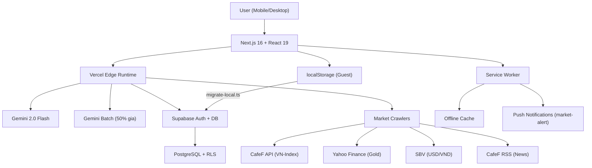

# VietFi Advisor — Co Van Tin Chinh AI Cho Nguoi Viet

[](https://nextjs.org/)
[](https://ai.google.dev/)
[](https://supabase.com/)
[](https://vietfi-advisor.vercel.app)
[](LICENSE)

> **Du an thi WDA 2026** — Ung dung web giup nguoi Viet quan ly tai chinh ca nhan bang AI, gamification, va du lieu thi truong thoi gian thuc.


---

## Muc Luc

- [🚨 BẢN PHÂN CÔNG CÔNG VIỆC WDA2026 (Hưng & Hoàng) 🚨](./WDA2026_PHAN_CONG.md)
- [Tong Quan](#tong-quan)
- [Tech Stack](#tech-stack)
- [Cai Dat & Chay](#cai-dat--chay)
- [Tinh Nang](#tinh-nang)
- [API Routes & Endpoints](#api-routes--endpoints)
- [Testing](#testing)
- [Kien Truc He Thong](#kien-truc-he-thong)
- [Team & Lien He](#team--lien-he)

---

## Tong Quan

**Van de:** Nguoi tre Viet Nam thieu cong cu quan ly tai chinh phu hop — cac app nuoc ngoai khong hieu context VN (vang SJC, lai suat huy dong, tin dung den, tra gop...).

**Giai phap:** VietFi Advisor = Duolingo + Mint + ChatGPT nhung cho tai chinh Viet Nam:
- 🦜 **Vet Vang AI** — Tro ly ao xeo sac, xung tao-may, nhac nho chi tieu
- 🎮 **Gamification** — Streak, XP, Leaderboard, Badges — bien quan ly tien thanh thoi quen
- 📊 **Data thi truong** — VN-Index, Vang SJC, USD/VND, Fear & Greed Index
- 📚 **Micro-learning** — Bai hoc tai chinh 60 giay, quiz nhanh

---

## Tech Stack

| Layer | Cong nghe | Ghi chu |
|-------|-----------|---------|
| **Framework** | Next.js 16.1.7 + React 19 | App Router, Edge Runtime |
| **Styling** | Tailwind CSS v4 | Utility-first |
| **UI** | Framer Motion + Recharts + Lucide Icons | Charts & animations |
| **AI** | Gemini 2.0 Flash (Vercel AI SDK 6.0) | Streaming, retry, JSON output |
| **Batch AI** | `gemini-batch.ts` | 50% cheaper batch API cho Morning Brief & News |
| **TTS** | Web Speech API (vi-VN) | Tu dong doc cau tra loi AI |
| **STT** | Web Speech API (webkitSpeechRecognition) | Voice input tieng Viet |
| **Auth** | Supabase Auth + `@supabase/ssr` | Email+Password, Google OAuth, SSR cookie-based sessions |
| **Database** | Supabase PostgreSQL | Auth users, RLS-ready |
| **Testing** | Vitest (57 tests) + Playwright E2E | 70% line coverage enforced |
| **Scraping** | Cheerio | Crawl VN-Index, Gold, USD/VND, News RSS |
| **Deploy** | Vercel | Production live |

---

## Cai Dat & Chay

```bash
git clone https://github.com/hungpixi/vietfi-advisor.git
cd vietfi-advisor
npm install
cp .env.example .env.local
# Dien GEMINI_API_KEY (bat buoc)
npm run dev   # → http://localhost:3000
```

### Environment Variables

| Key | Bat buoc | Mo ta |
|-----|----------|-------|
| `GEMINI_API_KEY` | ✅ | Google AI API key cho Vet Vang chatbot |
| `GEMINI_BASE_URL` | ❌ | Proxy URL neu can bypass (VD: Cloudflare Worker) |
| `NEXT_PUBLIC_SUPABASE_URL` | ✅ | Supabase project URL |
| `NEXT_PUBLIC_SUPABASE_ANON_KEY` | ✅ | Supabase anon key |
| `CRON_SECRET` | ❌ | Secret cho cron job API |

---

## Tinh Nang

### 1. Vet Vang AI Chatbot
Gemini 2.0 Flash streaming qua Edge Runtime. Personality: xung tao-may, roast chi tieu, <50 chu per response. Voice Input/Output tieng Viet (Web Speech API), pitch 1.3 cho giong vet. 7 Quick Actions, mascot thay doi anh theo 5 level + Lottie animation. 3-tier fallback: Regex parser → Scripted responses → Gemini.

### 2. Quan Ly Tai Chinh
- **Quy Chi tieu (6 Hu):** CRUD thu nhap/chi tieu, bieu do Recharts, canh bao overspending
- **Quy No:** Nhap no → Avalanche/Snowball optimizer → timeline tra no
- **Lam phat ca nhan:** So sanh CPI ca nhan vs quoc gia dua tren gio hang thuc te
- **Tinh cach dau tu:** Quiz 12 cau → risk scoring → profile (Bao thu/Can bang/Mao hiem)
- **Co van danh muc:** De xuat ty trong portfolio dua tren Risk DNA
- **Mua nha / Cho thue:** Calculator so sanh mua vs thue dua tren thu nhap + lai suat

### 3. Thi Truong & Vi Mo
Live data: VN-Index (cafef), Vang SJC (Yahoo Finance), USD/VND (SBV). Auto-refresh 5 phut + cron job 8:30am weekdays. Fear & Greed Index VN, AI commentary.

### 4. Gamification
XP System, 5 Levels (Vet Con → Teen → Truong Thanh → Dai Gia → Ong Hoang), Streak, 8 Badges, Confetti, Bang xep hang (1 user + 14 bot AI), Micro-learning 12+ bai hoc 60s, Sound effects.

### 5. PWA + Push Notifications
Service Worker offline cache, "Add to Home Screen", Push Notifications khi VN-Index ±2% hoac Vang ±3%.

### 6. Live News + Morning Brief AI
Crawl CafeF RSS, Gemini sentiment analysis (Tich cuc/Tieu cuc/Trung lap), AI Morning Brief tu live articles via Gemini batch API (50% gia).

### 7. VN Stock Screener
Loc co phieu theo maxPE, maxPB, minROE, exchange.

### 8. Supabase Sync + Google OAuth
Background sync localStorage ↔ Supabase (RLS-protected), one-time migration.

### 9. Data Export
CSV Export chi tieu + no (BOM cho Excel Viet hoa).

---

## API Routes & Endpoints

| Method | Endpoint | Mo ta | Status |
|--------|----------|-------|--------|
| POST | `/api/chat` | Gemini streaming chat (Vet Vang) | ✅ |
| POST | `/api/tts` | Text-to-Speech (edge-tts) | ✅ |
| GET | `/api/market-data` | Live market data (VN-Index, Gold, USD) | ✅ |
| POST | `/api/cron/market-data` | Cron job (CRON_SECRET) | ✅ |
| GET | `/api/news` | Tin tuc AI + sentiment (CafeF RSS) | ✅ |
| GET | `/api/morning-brief` | AI Morning Brief | ✅ |
| POST | `/api/cron/morning-brief` | Cron job for morning brief (CRON_SECRET) | ✅ |
| GET | `/api/stock-screener` | VN stock screening | ✅ |
| GET | `/auth/confirm` | Email OTP confirmation | ✅ |
| POST | `/auth/signout` | Sign out user | ✅ |

---

## Testing

```bash
npm test              # Vitest (watch mode)
npm run test:run      # Vitest single run, CI
npm run test:e2e      # Playwright E2E — all specs
npm run test:e2e:ui   # Playwright with UI mode
npm run test:e2e:headed  # Playwright headed
npm run test:e2e:debug  # Playwright debug
```

57 Vitest unit tests across 10 files. Playwright E2E coverage: landing, onboarding, budget management (15 tests). 70% line coverage enforced.

---

## Kien Truc He Thong



---

## Team & Lien He

- **Hung** — AI, Frontend, Gamification, Voice
- **Hoang** — Data Crawling, Market APIs, News Scraping

> Du an thi **WDA 2026** — De tai Tai chinh ca nhan

<p align="center">
  <a href="https://comarai.com"></a>
  <a href="https://zalo.me/0834422439"></a>
  <a href="mailto:hungphamphunguyen@gmail.com"></a>
</p>

<p align="center">
  <b>Comarai</b> — Companion for Marketing & AI Automation Agency<br/>
  4 nhân viên AI chạy 24/7: 🤝 Em Sale • ✍️ Em Content • 📊 Em Marketing • 📈 Em Trade<br/>
  <i>"Bạn bận kiếm tiền, để AI lo phần còn lại."</i>
</p>

<p align="center">
  <a href="https://github.com/hungpixi">GitHub</a> •
  <a href="https://comarai.com">Website</a> •
  <a href="https://zalo.me/0834422439">Zalo</a> •
  <a href="mailto:hungphamphunguyen@gmail.com">Email</a>
</p>
