# VietFi Advisor — Co Van Tin Chinh AI Cho Nguoi Viet

[](https://nextjs.org/)
[](https://ai.google.dev/)
[](https://supabase.com/)
[](https://vietfi-advisor.vercel.app)
[](LICENSE)

> **Du an thi WDA 2026** — Ung dung web giup nguoi Viet quan ly tai chinh ca nhan bang AI, gamification, va du lieu thi truong thoi gian thuc.

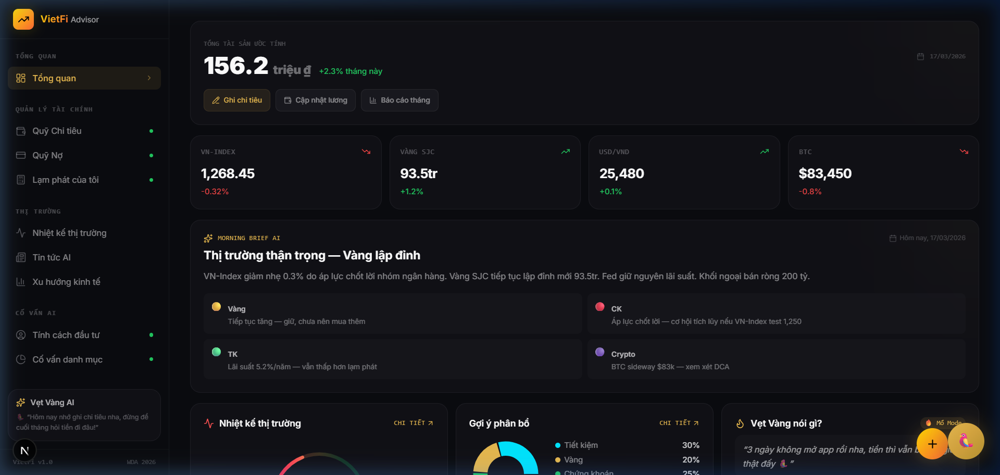

---

## Muc Luc

- [Tong Quan](#-tong-quan)
- [Tech Stack](#-tech-stack)
- [Cai Dat & Chay](#-cai-dat--chay)
- [Cau Truc Du An](#-cau-truc-du-an)
- [Tinh Nang Da Hoan Thanh](#-tinh-nang-da-hoan-thanh)
- [Quá Trình Tư Duy](#-quá-trình-tư-duy)
- [Trang Thai Hien Tai & Viec Can Lam](#-trang-thai-hien-tai--viec-can-lam)
- [API Routes & Endpoints](#-api-routes--endpoints)
- [Lien He](#-lien-he)

---

## Tong Quan

**Van de:** Nguoi tre Viet Nam thieu cong cu quan ly tai chinh phu hop — cac app nuoc ngoai khong hieu context VN (vang SJC, lai suat huy dong, tin dung den, tra gop...).

**Giai phap:** VietFi Advisor = Duolingo + Mint + ChatGPT nhung cho tai chinh Viet Nam:
- 🦜 **Vet Vang AI** — Tro ly ao xeo sac, xung tao-may, nhac nho chi tieu
- 🎮 **Gamification** — Streak, XP, Leaderboard, Badges — bien quan ly tien thanh thoi quen
- 📊 **Data thi truong** — VN-Index, Vang SJC, USD/VND, Fear & Greed Index
- 📚 **Micro-learning** — Bai hoc tai chinh 60 giay, quiz nhanh

---

## Tech Stack

| Layer | Cong nghe | Ghi chu |
|-------|-----------|---------|
| **Framework** | Next.js 16.1.7 + React 19 | App Router, Edge Runtime |
| **Styling** | Tailwind CSS v4 | Utility-first |
| **UI** | Framer Motion + Recharts + Lucide Icons | Charts & animations |
| **AI** | Gemini 2.0 Flash (Vercel AI SDK 6.0) | Streaming, retry, JSON output |
| **TTS** | Web Speech API (vi-VN) | Tu dong doc cau tra loi AI |
| **STT** | Web Speech API (webkitSpeechRecognition) | Voice input tieng Viet |
| **Auth** | Supabase Auth + `@supabase/ssr` | Email+Password, SSR cookie-based sessions |
| **Database** | Supabase PostgreSQL | Auth users, RLS-ready |
| **Testing** | Vitest (48+ tests) | Parser, crawler, API, component |
| **Scraping** | Cheerio | Crawl VN-Index, Gold, USD/VND |
| **Deploy** | Vercel | Production live |

---

## Cai Dat & Chay

```bash
# 1. Clone
git clone https://github.com/hungpixi/vietfi-advisor.git
cd vietfi-advisor

# 2. Install dependencies
npm install

# 3. Copy env
cp .env.example .env.local
# Dien GEMINI_API_KEY (bat buoc)
# Dien SUPABASE keys (neu co)

# 4. Chay dev
npm run dev
# → http://localhost:3000
```

### Environment Variables

| Key | Bat buoc | Mo ta |
|-----|----------|-------|
| `GEMINI_API_KEY` | ✅ | Google AI API key cho Vet Vang chatbot |
| `GEMINI_BASE_URL` | ❌ | Proxy URL neu can bypass (VD: Cloudflare Worker) |
| `NEXT_PUBLIC_SUPABASE_URL` | ✅ | Supabase project URL |
| `NEXT_PUBLIC_SUPABASE_ANON_KEY` | ✅ | Supabase anon key |
| `CRON_SECRET` | ❌ | Secret cho cron job API |

---

## Cau Truc Du An

```
vietfi-advisor/
├── src/
│   ├── proxy.ts                        # Next.js 16 proxy (session refresh)
│   ├── app/
│   │   ├── page.tsx                    # Landing page
│   │   ├── layout.tsx                  # Root layout + fonts
│   │   ├── globals.css                 # Tailwind v4 config
│   │   ├── login/                      # Auth pages
│   │   │   ├── page.tsx                # Login/Signup form
│   │   │   └── actions.ts             # Server actions (login, signup)
│   │   ├── auth/                       # Auth routes
│   │   │   ├── confirm/route.ts       # Email OTP confirmation
│   │   │   └── signout/route.ts       # Sign out handler
│   │   ├── api/
│   │   │   ├── chat/route.ts          # Gemini streaming API
│   │   │   ├── tts/route.ts           # Text-to-Speech API
│   │   │   ├── market-data/
│   │   │   │   └── route.ts          # Live market data (VN-Index, Gold, USD)
│   │   │   └── cron/
│   │   │       └── market-data/route.ts  # Vercel Cron endpoint
│   │   ├── dashboard/
│   │   │   ├── page.tsx               # Tong quan (hub chinh)
│   │   │   ├── layout.tsx            # Sidebar + Gamification bar
│   │   │   ├── budget/page.tsx       # Quy Chi tieu (6 Hu)
│   │   │   ├── debt/page.tsx          # Quy No (Avalanche/Snowball)
│   │   │   ├── personal-cpi/page.tsx # Lam phat ca nhan
│   │   │   ├── leaderboard/page.tsx   # Bang xep hang
│   │   │   ├── learn/page.tsx         # Bai hoc 60 giay
│   │   │   ├── sentiment/page.tsx     # Nhiet ke thi truong
│   │   │   ├── news/page.tsx          # Tin tuc AI
│   │   │   ├── macro/page.tsx         # Xu huong kinh te (live data)
│   │   │   ├── risk-profile/page.tsx  # Tinh cach dau tu
│   │   │   └── portfolio/page.tsx     # Co van danh muc
│   │   └── test/                       # Vitest setup
│   ├── components/
│   │   ├── vet-vang/
│   │   │   ├── VetVangFloat.tsx       # Floating button mo chat
│   │   │   └── VetVangChat.tsx        # Chat window + TTS + STT
│   │   ├── gamification/
│   │   │   ├── Badges.tsx             # 8 hieu hieu
│   │   │   ├── Celebration.tsx        # Confetti len level
│   │   │   ├── ShareCard.tsx          # Share MXH
│   │   │   ├── WeeklyReport.tsx       # Bao cao tuan
│   │   │   └── XPToast.tsx            # Popup +XP
│   │   └── onboarding/
│   │       └── QuickSetupWizard.tsx   # Setup thu nhap ban dau
│   ├── lib/
│   │   ├── gemini.ts                  # callGemini + callGeminiJSON (retry)
│   │   ├── supabase.ts                # Legacy client (backward compat)
│   │   ├── supabase/                  # SSR Auth clients
│   │   │   ├── client.ts             # Browser client (@supabase/ssr)
│   │   │   ├── server.ts            # Server client (cookie-based)
│   │   │   └── middleware.ts        # Session refresh helper
│   │   ├── gamification.ts            # XP, Streak, Levels, Badges
│   │   ├── onboarding-state.ts        # Trang thai onboarding
│   │   ├── expense-parser.ts           # Regex expense parser (0 AI calls)
│   │   ├── scripted-responses.ts      # 500+ canned responses
│   │   └── calculations/
│   │       ├── debt-optimizer.ts     # Avalanche & Snowball solver
│   │       ├── fg-index.ts            # Fear & Greed Index VN
│   │       ├── personal-cpi.ts      # CPI ca nhan calculator
│   │       └── risk-scoring.ts       # Cham diem rui ro dau tu
│   └── lib/market-data/
│       ├── crawler.ts                # Crawl VN-Index, Gold SJC, USD/VND
│       ├── parser.ts                  # Vietnamese number/text parsing
│       ├── crawler.test.ts           # 9 tests
│       └── parser.test.ts            # 19 tests
├── public/
│   ├── assets/                       # Mascot images (5 levels)
│   ├── docs/                         # Screenshots cho README
│   └── quotes.json                   # 40 quotes cho Vet Vang
├── scripts/
│   └── generate_audio.py             # VieNeu-TTS voice pipeline
├── voice_ref/                         # Voice reference files (gitignored)
├── ui-prototype/                      # HTML prototype ban dau
├── vitest.config.ts                   # Vitest configuration
└── .env.example                       # Template cho env vars
```

---

## Tinh Nang Da Hoan Thanh

### 1. Vet Vang AI Chatbot
- Gemini 2.0 Flash streaming qua Edge Runtime
- Personality: xung tao-may, roast chi tieu, <50 chu per response
- Voice Input: nhan dien giong noi tieng Viet (Web Speech API)
- Voice Output: TTS tu dong doc cau tra loi (pitch 1.3 cho giong vet)
- 7 Quick Actions: Chi tiêu, Nợ, Đầu tư, Motivate, Vàng vs CK, Lạm phát, Mua nhà
- Mascot thay doi anh theo Level (5 levels)
- 3-tier fallback: Regex parser → Scripted responses → Gemini

### 2. Quan Ly Tai Chinh
- **Quy Chi tieu (6 Hu):** CRUD thu nhap/chi tieu, bieu do Recharts, canh bao overspending
- **Quy No:** Nhap no → Avalanche/Snowball optimizer → timeline tra no
- **Lam phat ca nhan:** So sanh CPI ca nhan vs quoc gia dua tren gio hang thuc te
- **Tinh cach dau tu:** Quiz 12 cau → risk scoring → profile (Bao thu/Can bang/Mao hiem)
- **Co van danh muc:** De xuat ty trong portfolio dua tren Risk DNA

### 3. Thi Truong & Vi Mo
- **Xu huong kinh te** — du lieu **thoi gian thuc**: VN-Index (cafef), Vang SJC (Yahoo Finance), USD/VND (SBV homepage)
- Auto-refresh moi 5 phut + cron job sang 8:30am (weekdays)
- AI commentary tu sinh tu du lieu thuc
- Nhiet ke thi truong (Fear & Greed Index VN)

### 4. Gamification
- XP System (+10 moi action)
- 5 Levels: Vet Con → Teen → Truong Thanh → Dai Gia → Ong Hoang
- Streak (ngay lien tiep), 8 Badges, Confetti celebrations
- Bang xep hang (1 user + 14 bot AI)
- Micro-learning: 12+ bai hoc 60s + quiz

### 5. PWA + Push Notifications
- **Service Worker** — offline cache trang chinh, stale-while-revalidate
- **Manifest.json** — "Add to Home Screen" cho mobile
- **Push Notifications** — canh bao khi VN-Index ±2%, Vang ±3%
- **Permission banner** — UX moi khi lan dau vao dashboard

### 6. Live News + Morning Brief AI
- **Tin tuc AI** — crawl CafeF RSS, Gemini AI sentiment analysis (Tich cuc/Tieu cuc/Trung lap)
- **Morning Brief** — tu sinh brief moi ngay tu live articles
- **Auto-refresh** — cache 5 phut, fallback offline

### 7. Supabase Sync + Google OAuth
- **Google OAuth** — dang nhap nhanh 1-click
- **Budget/Debt sync** — background sync localStorage ↔ Supabase
- **RLS policies** — bao mat du lieu theo user

### 8. Data Export
- **CSV Export** — xuat chi tieu + khoan no ra CSV (BOM cho Excel Viet hoa)

---

## Ky thuat Test

```bash
npm test       # Vitest — 48+ tests, 6+ files
```

| File | Tests | Muc do |
|------|-------|--------|
| `src/lib/market-data/parser.test.ts` | 19 | VnFloat, extractNumber, ranges, currencyMode |
| `src/lib/market-data/crawler.test.ts` | 9 | VN-Index, Gold SJC, USD/VND |
| `src/app/api/market-data/route.test.ts` | 3 | 200 OK, 500 error, partial data |
| `src/app/dashboard/macro/page.test.tsx` | 5 | Loading skeleton, success, error, retry |

---

## API Routes & Endpoints

| Method | Endpoint | Mo ta | Status |
|--------|----------|-------|--------|
| POST | `/api/chat` | Gemini streaming chat (Vet Vang) | ✅ Hoat dong |
| POST | `/api/tts` | Text-to-Speech (edge-tts) | ✅ Hoat dong |
| GET | `/api/market-data` | Live market data (VN-Index, Gold, USD) | ✅ Hoat dong |
| POST | `/api/cron/market-data` | Cron job (Vercel Cron, CRON_SECRET) | ✅ Hoat dong |
| GET | `/auth/confirm` | Email OTP confirmation | ✅ Hoat dong |
| POST | `/auth/signout` | Sign out user | ✅ Hoat dong |
| GET | `/api/news` | Tin tuc AI + sentiment analysis | ✅ Hoat dong |

---

## Trang Thai Hien Tai & Viec Can Lam

### Da xong ✅
- [x] Landing page
- [x] 10 dashboard pages (UI + logic)
- [x] Vet Vang AI chatbot (Gemini streaming)
- [x] TTS + STT (Web Speech API)
- [x] Gamification system day du
- [x] 4 calculation engines
- [x] Voice clone pipeline (VieNeu-TTS script)
- [x] **Supabase Auth** — Email+Password, SSR cookie sessions, login/signup page
- [x] **Live market data** — VN-Index, Gold SJC, USD/VND crawl + dashboard
- [x] **Vitest tests** — 36 tests (parser, crawler, API, component)
- [x] **Vercel Deploy** — Production live tai [vietfi-advisor.vercel.app](https://vietfi-advisor.vercel.app)

### Can lam

1. **Supabase migration** — wire up `src/lib/supabase.ts` de thay localStorage
2. **News scrape + AI tom tat** — crawl cafef/vnexpress + Gemini summarize
3. **PWA** — service worker + offline support
4. **Playwright E2E tests** — vitest chi cover unit; can playwright cho critical user flows

---

## Screenshots

| Tinh nang | Preview |
|-----------|---------|
| Dashboard |  |
| Quy No | 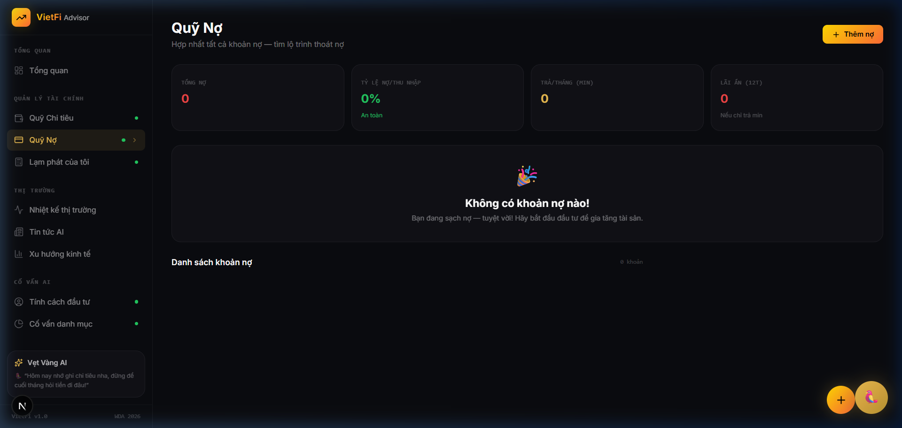 |
| Quy Chi tieu | 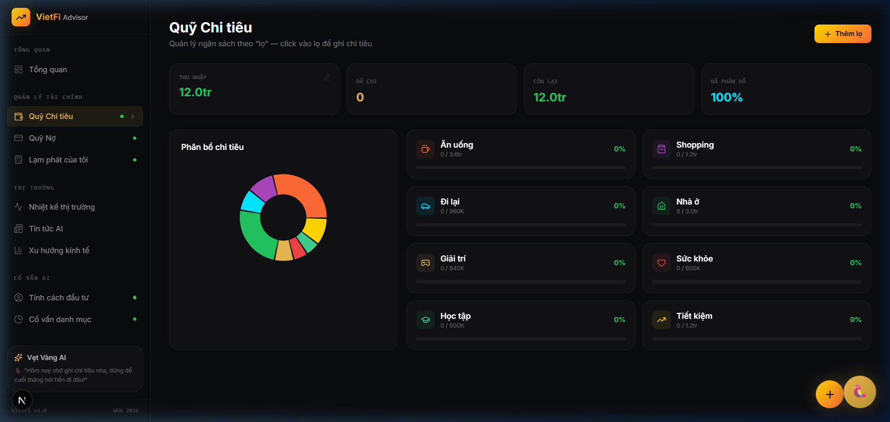 |
| Nhiet ke thi truong | 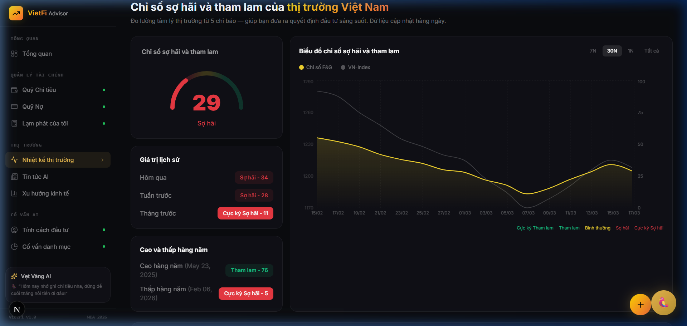 |
| Bang xep hang | 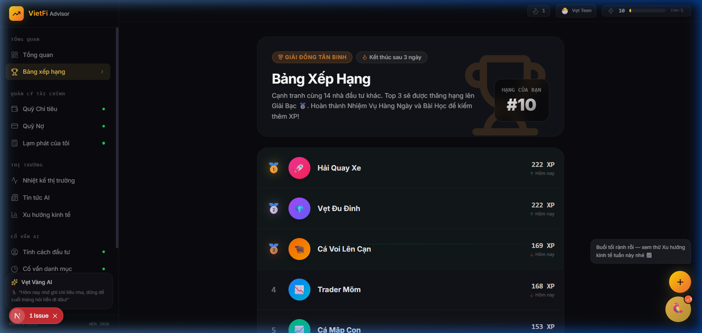 |
| Bai hoc tai chinh | 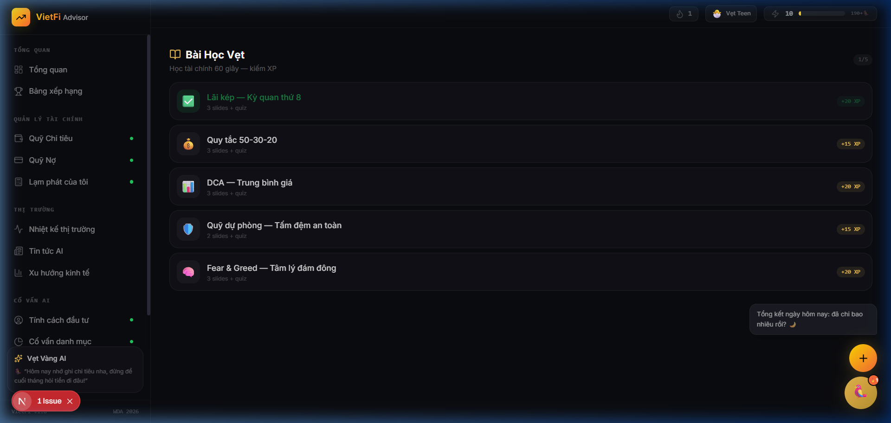 |
| Xu huong kinh te | 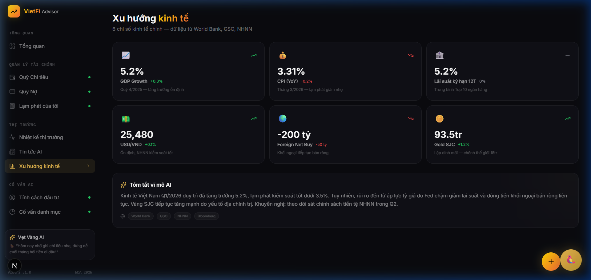 |
| Tinh cach dau tu | 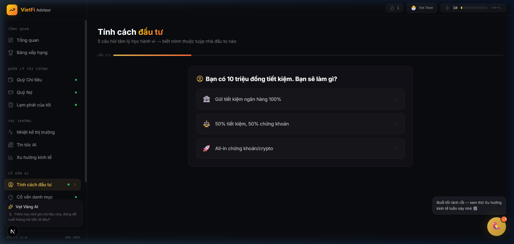 |
| Co van danh muc | 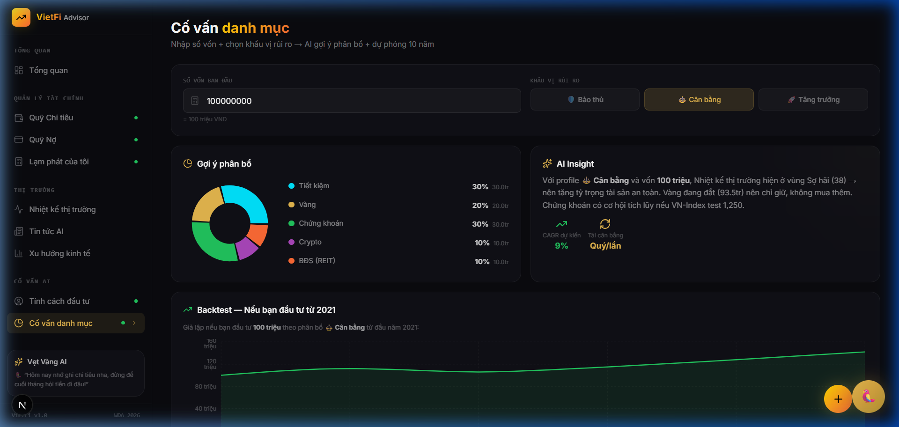 |
| CPI ca nhan | 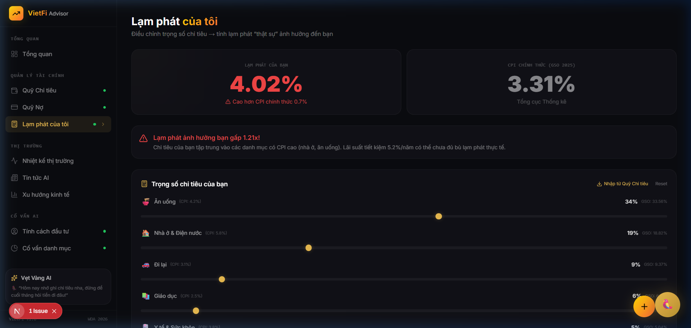 |

---

## Kien Truc He Thong

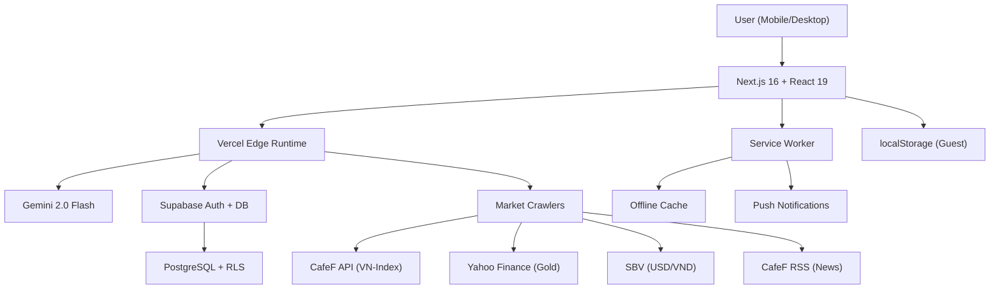

## Quá Trình Tư Duy

**Tại sao chọn Next.js 16 + Vercel?**
- App Router cho SSR/SSG hybrid → SEO tốt, load nhanh
- Edge Runtime → latency thấp cho Gemini streaming
- Vercel Cron → free scheduled crawling

**Tại sao Gamification?**
- Gen Z Vietnam quen với Duolingo/game → áp dụng streak + XP vào tài chính
- Leaderboard tạo social pressure → duy trì thói quen ghi chi tiêu

**Tại sao local-first + Supabase hybrid?**
- Guest users dùng localStorage → 0 friction, không cần đăng ký
- Logged-in users sync lên Supabase → data an toàn, multi-device

**Khác biệt so với app tài chính khác?**
- **Vẹt Vàng AI** — chatbot xéo xắc, xưng tao-mày → gần gũi GenZ VN
- **Live market data** — crawl real-time, không dùng API trả phí
- **Push notifications** — cảnh báo biến động mạnh, không spam

## Huong Di Tuong Lai

1. ✅ ~~Supabase Auth~~ + ~~Google OAuth~~
2. ✅ ~~Live Market Data~~ + ~~News AI~~
3. ✅ ~~PWA + Push Notifications~~
4. ✅ ~~CSV Export~~
5. **Voice Clone** — giong Vet Vang clone tu ZinZin (VieNeu-TTS)
6. **Mascot Animation** — Rive animation cho Vet Vang
7. **AI Insights** — phan tich chi tieu tu dong, du bao cashflow
8. **Live Leaderboard** — connect Supabase gamification table
9. **Playwright E2E Tests** — cover critical user flows

---

## Team

- **Hung** — AI, Frontend, Gamification, Voice
- **Hoang** — Data Crawling, Market APIs, News Scraping

> Du an thi **WDA 2026** — De tai Tai chinh ca nhan

---

## 🤖 Bạn muốn ứng dụng AI tương tự?

| Bạn cần | Chúng tôi đã làm ✅ |
|---------|---------------------|
| AI Chatbot cho app | Vẹt Vàng — Gemini streaming + TTS + STT |
| Dashboard tài chính | 11 trang, real-time market data, gamification |
| Crawl dữ liệu live | VN-Index, Gold, USD/VND, News RSS |
| PWA + Push Notifications | Service Worker + Web Push |
| Auth + Database | Supabase Auth + PostgreSQL + RLS |

<p align="center">
  <a href="https://comarai.com"></a>
  <a href="https://zalo.me/0834422439"></a>
  <a href="mailto:hungphamphunguyen@gmail.com"></a>
</p>

<p align="center">
  <b>Comarai</b> — Companion for Marketing & AI Automation Agency<br/>
  4 nhân viên AI chạy 24/7: 🤝 Em Sale • ✍️ Em Content • 📊 Em Marketing • 📈 Em Trade<br/>
  <i>"Bạn bận kiếm tiền, để AI lo phần còn lại."</i>
</p>

<p align="center">
  <a href="https://github.com/hungpixi">GitHub</a> •
  <a href="https://comarai.com">Website</a> •
  <a href="https://zalo.me/0834422439">Zalo</a> •
  <a href="mailto:hungphamphunguyen@gmail.com">Email</a>
</p>
