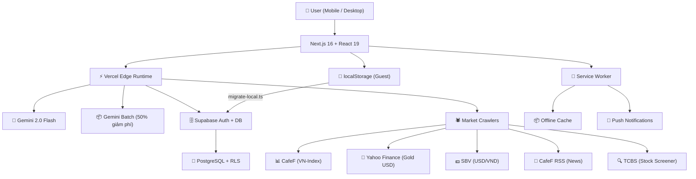

# VietFi Advisor — Cố Vấn Tài Chính AI Cho Người Việt

<!-- ALL BADGES -->
<div align="center">

[](https://nextjs.org/)
[](https://react.dev/)
[](https://ai.google.dev/)
[](https://tailwindcss.com/)
[](https://supabase.com/)
[](LICENSE)
[](#)

**AI tài chính · Gamification · Dữ liệu thị trường thời gian thực · Tiếng Việt**

Vẹt Vàng — con vẹt vàng thông minh nhất Việt Nam 🦜💛

[🚀 Live Demo](https://vietfi-advisor.vercel.app) · [📖 Tài liệu](#) · [📋 Bảng phân công](./WDA2026_PHAN_CONG.md) · [🐛 Báo lỗi](https://github.com/hungpixi/vietfi-advisor/issues)

</div>

---

## Mục Lục

- [Tổng Quan](#tổng-quan)
- [Tính Năng](#tính-năng)
- [Tech Stack](#tech-stack)
- [Cài Đặt & Chạy](#cài-đặt--chạy)
- [Kiến Trúc Hệ Thống](#kiến-trúc-hệ-thống)
- [API Routes](#api-routes)
- [Cấu Trúc Dự Án](#cấu-trúc-dự-án)
- [Testing](#testing)
- [Deployment](#deployment)
- [Contributing](#contributing)

---

## Tổng Quan

### Vấn Đề

Người trẻ Việt Nam thiếu công cụ quản lý tài chính phù hợp — các app nước ngoài không hiểu context VN (vàng SJC, lãi suất huy động, tín dụng, trả góp...) và các app nội địa thì rời rạc, thiếu AI.

### Giải Pháp

**VietFi Advisor = Duolingo + Mint + ChatGPT cho tài chính Việt Nam:**

| Thành phần | Mô tả |
|---|---|
| 🦜 **Vẹt Vàng AI** | Trợ lý ao xoắc quắt, mổ tiêu xài dở, nhắc nhở chi tiêu — thay đổi avatar theo 5 level |
| 🎮 **Gamification** | XP, streak, leaderboard, badge, confetti — biến quản lý tiền thành thói quen |
| 📊 **Thị Trường** | VN-Index, Vàng SJC, USD/VND, Fear & Greed Index thời gian thực |
| 💰 **Quỹ Tiết Kiệm** | 6 quỹ chi tiêu, biểu đồ, cảnh báo overspending |
| 🏦 **Trung Tâm Nợ** | Nhập nợ → Avalanche/Snowball optimizer → timeline trả nợ |
| 📚 **Micro-learning** | Bài học tài chính 60 giây, quiz nhanh |
| 🔊 **Voice I/O** | Nói tiếng Việt với Vẹt Vàng (Web Speech API + edge-tts) |

### Giá Trị Cốt Lõi WDA2026

1. **Problem 1: Centralized Debt Hub** — Trung tâm nợ tập trung với AI optimizer
2. **Problem 2: AI Financial Advisor** — Vẹt Vàng với 3-tier AI pipeline
3. **Gamification** — XP/level system để xây thói quen tài chính
4. **Vietnamese Context** — Vàng SJC, VN-Index, USD/VND, lãi suất Sacombank/Eximbank

---

## Tính Năng

### 1. Vẹt Vàng AI Chatbot 🦜

Chatbot AI streaming với Gemini 2.0 Flash qua Edge Runtime. Personality: xoắc quắt, mổ chi tiêu, dưới 50 chữ mỗi response. Voice Input/Output tiếng Việt (Web Speech API + edge-tts).

**3-tier fallback — tối ưu chi phí:**

```
Tin nhắn user
    ↓
Tier 1: Regex expense parser ("phở 30k" → {item, amount, category})
    ↓ (không match)
Tier 2: Scripted responses (500+ canned responses, 25 intents)
    ↓ (không match)
Tier 3: Gemini streaming (Edge Runtime, 3-attempt retry)
```

**Mood states:** 🔥 Mổ (roast bad spending), 💛 Khen (praise good habits), 🧠 Thâm (insightful analysis), 😴 Chán (bored/complaining)

### 2. Quản Lý Tài Chính 💰

| Tính năng | Mô tả |
|---|---|
| **Quỹ Chi tiêu (6 Hũ)** | CRUD thu nhập/chi tiêu, biểu đồ Recharts, cảnh báo overspending |
| **Trung Tâm Nợ** | Nhập nợ → Avalanche/Snowball → timeline trả nợ + DTI gauge |
| **Lạm phát cá nhân** | So sánh CPI cá nhân vs quốc gia (7 hạng mục GSO) |
| **DNA Rủi Ro** | Quiz 12 câu → risk profile (Bảo thủ / Cân bằng / Mạo hiểm) |
| **Cố vấn danh mục** | Gợi ý phân bổ dựa trên Risk DNA |
| **Mua nhà / Thuê** | Calculator so sánh mua vs thuê dựa trên thu nhập + lãi suất |

### 3. Thị Trường & Vĩ Mô 📊

Dữ liệu thời gian thực từ nhiều nguồn:

| Nguồn | Dữ liệu |
|---|---|
| CafeF | VN-Index, giá cổ phiếu |
| Yahoo Finance | Vàng USD |
| SBV | USD/VND |
| CafeF RSS | Tin tức tài chính |
| TCBS | Dữ liệu stock screener |

- Auto-refresh mỗi 5 phút
- Cron job 8:30am các ngày làm việc
- Fear & Greed Index VN + AI commentary

### 4. VN Stock Screener 🔍

Lọc cổ phiếu theo: maxPE, maxPB, minROE, exchange (HOSE/HNX/UPCOM). VN30 mock data fallback khi TCBS down.

### 5. AI Investment Guru Hub 🧙‍♂️

5 nhân vật huyền thoại đầu tư — mỗi người có phong cách riêng:

| Guru | Phong cách |
|---|---|
| 🐻 Jesse Livermore | Breakout trading, kiên nhẫn chờ sóng lớn |
| 🧙‍♂️ Mark Minervini | SEPA + VCP, cắt lỗ 5-8% tuyệt đối |
| 📈 William O'Neil | CANSLIM, mua điểm phá vỡ với EPS tăng trưởng 25%+ |
| 🕺 Nicolas Darvas | Hộp Darvas, breakout với khối lượng cực lớn |
| 🔄 Stan Weinstein | 4 giai đoạn chu kỳ, MA30 Tuần |

Gates theo XP: mỗi guru yêu cầu "mời 3 ly cà phê" (tương ứng XP milestones).

### 6. Gamification 🎮

| Thành phần | Chi tiết |
|---|---|
| **XP System** | Kiếm XP từ hành động tài chính |
| **5 Levels** | Vẹt Con → Vẹt Teen → Vẹt Phố → Vẹt Nhà Giàu → Vẹt Hoàng |
| **Streak** | Streak ngày liên tiếp |
| **8 Badges** | Thành tựu khác nhau |
| **Confetti** | Animation khi lên level |
| **Leaderboard** | 1 user thật + 14 bot AI competitors |
| **Promo Code** | `hungpixi` → LEGEND tier bypass |

### 7. PWA + Notifications 📲

- Service Worker offline cache
- "Add to Home Screen"
- Push Notifications khi VN-Index ±2% hoặc Vàng ±3%

### 8. Voice System 🔊

| Layer | Công nghệ |
|---|---|
| Primary TTS | `edge-tts-universal` (72+ pre-rendered MP3) |
| Fallback TTS | Web Speech API (pitch 1.3, rate 0.92) |
| Voice Clone | Python scripts + ZinZin WAV reference + FFmpeg |
| STT | `webkitSpeechRecognition` |

---

## Tech Stack

| Layer | Công nghệ | Ghi chú |
|---|---|---|
| **Framework** | Next.js 16.1.7 + React 19 | App Router, Edge Runtime |
| **Language** | TypeScript (strict mode) | |
| **Styling** | Tailwind CSS v4 | CSS custom properties + `.glass-card` |
| **UI** | Framer Motion + Recharts + Lucide Icons | Charts & animations |
| **AI** | Gemini 2.0 Flash + Vercel AI SDK 6.0 | Streaming + retry + JSON output |
| **Batch AI** | `gemini-batch.ts` | Batch API — 50% chi phí |
| **Auth** | Supabase Auth + `@supabase/ssr` | SSR cookie-based sessions |
| **Database** | Supabase PostgreSQL + RLS | |
| **Scraping** | Cheerio | CafeF, Yahoo, SBV, CafeF RSS |
| **TTS** | edge-tts-universal | 72+ Vietnamese MP3 files |
| **Testing** | Vitest (57 tests) + Playwright E2E | 70% coverage |
| **PWA** | Service Worker + manifest.json | Offline + push |
| **Deploy** | Vercel | Production live |

---

## Cài Đặt & Chạy

### Yêu Cầu

- Node.js 20+
- npm 10+

### Setup

```bash
git clone https://github.com/hungpixi/vietfi-advisor.git
cd vietfi-advisor
npm install
cp .env.example .env.local
```

### Cấu hình `.env.local`

```env
# BẮT BUỘC
GEMINI_API_KEY=your_google_ai_api_key_here

# BẮT BUỘC ( Supabase )
NEXT_PUBLIC_SUPABASE_URL=https://your-project.supabase.co
NEXT_PUBLIC_SUPABASE_ANON_KEY=your_anon_key_here
CRON_SECRET=your_cron_secret_here

# TÙY CHỌN
GEMINI_BASE_URL=    # Proxy URL (VD: Cloudflare Worker)
```

> [!TIP]
> Lấy `GEMINI_API_KEY` tại [Google AI Studio](https://aistudio.google.com/app/apikey)

### Chạy

```bash
npm run dev   # Dev server → http://localhost:3000
```

### Scripts bổ sung

```bash
npm run build          # Production build
npm run lint           # ESLint 9
npm test               # Vitest watch mode
npm run test:run       # Vitest single run (CI)
npm run test:e2e       # Playwright E2E
npm run test:e2e:ui    # Playwright UI mode
npm run test:e2e:headed  # Playwright headed
```

### Generate TTS Audio Bank

```bash
npx tsx scripts/generate-tts-bank.ts
```

Tạo 72+ file MP3 tiếng Việt cho Vẹt Vàng từ `edge-tts-universal` (voice: `vi-VN-HoaiMyNeural`).

---

## Kiến Trúc Hệ Thống



### Data Flow

```
Guest user → localStorage (18 keys) → migrate-local.ts → Supabase (one-time)
Logged-in user → Supabase direct → useUserData.ts hooks
```

### Cron Schedule (Vercel Hobby)

| Cron | Schedule | Mô tả |
|---|---|---|
| Market Data | `30 8 * * 1-5` | 8:30am các ngày làm việc |
| Morning Brief | `0 23 * * *` | 11pm hàng ngày |
| Macro Update | `0 0 1 * *` | Ngày 1 hàng tháng |

---

## API Routes

| Method | Endpoint | Mô tả | Auth |
|---|---|---|---|
| `POST` | `/api/chat` | Gemini streaming chat (Vẹt Vàng) | — |
| `POST` | `/api/tts` | Text-to-Speech (edge-tts) | — |
| `GET` | `/api/market-data` | Live market data (VN-Index, Gold, USD) | — |
| `POST` | `/api/cron/market-data` | Cron: market data refresh | `CRON_SECRET` |
| `GET` | `/api/news` | Tin tức + sentiment (CafeF RSS) | — |
| `GET` | `/api/morning-brief` | AI Morning Brief (Gemini hoặc heuristic fallback) | — |
| `POST` | `/api/cron/morning-brief` | Cron: morning brief prep | `CRON_SECRET` |
| `POST` | `/api/cron/macro-update` | Cron: macro update (1st monthly) | `CRON_SECRET` |
| `GET` | `/api/stock-screener` | VN stock screener (TCBS, VN30 fallback) | — |
| `GET` | `/auth/confirm` | Email OTP confirmation | — |
| `POST` | `/auth/signout` | Sign out user | Session |

---

## Cấu Trúc Dự Án

```
vietfi-advisor/
├── src/
│   ├── app/
│   │   ├── api/                    # API routes
│   │   │   ├── chat/              # Gemini streaming
│   │   │   ├── market-data/       # Live market data
│   │   │   ├── news/              # News + sentiment
│   │   │   ├── morning-brief/     # AI morning brief
│   │   │   ├── stock-screener/    # VN stock filter
│   │   │   ├── tts/               # Edge TTS
│   │   │   ├── cron/              # Cron job handlers
│   │   │   └── auth/              # Supabase auth
│   │   ├── dashboard/             # Dashboard pages
│   │   │   ├── budget/            # 💰 Quỹ chi tiêu
│   │   │   ├── debt/              # 🏦 Trung tâm nợ
│   │   │   ├── portfolio/         # 💎 Gold + Allocation
│   │   │   ├── risk-profile/      # 🎯 DNA rủi ro
│   │   │   ├── personal-cpi/      # 📊 Lạm phát cá nhân
│   │   │   ├── market/           # 📈 Thị trường
│   │   │   ├── screener/         # 🔍 Stock screener
│   │   │   ├── sentiment/         # 😱 Fear & Greed
│   │   │   ├── news/              # 📰 Tin tức
│   │   │   ├── macro/             # 🌍 Vĩ mô
│   │   │   ├── gurus/             # 🧙‍♂️ AI Guru hub
│   │   │   ├── housing/           # 🏠 Buy vs Rent
│   │   │   ├── leaderboard/       # 🏆 XP rankings
│   │   │   ├── learn/             # 📚 Micro-learning
│   │   │   ├── components/        # Shared dashboard components
│   │   │   └── layout.tsx         # Dashboard shell
│   │   ├── login/                 # Auth page
│   │   ├── auth/                  # Auth handlers
│   │   └── page.tsx              # Landing page
│   ├── components/
│   │   ├── vet-vang/              # 🦜 Vẹt Vàng system
│   │   │   ├── VetVangChat.tsx   # Chat interface
│   │   │   ├── VetVangFloat.tsx  # Floating mascot
│   │   │   ├── VetVangConfig.tsx  # Avatar config
│   │   │   └── AnimatedParrot.tsx # Lottie animation
│   │   ├── gamification/          # 🎮 XP, badges, confetti
│   │   ├── debt/                  # 🏦 Debt hub components
│   │   ├── portfolio/             # 💎 Gold tracker, cashflow
│   │   └── onboarding/            # 🚀 Quick setup wizard
│   └── lib/
│       ├── calculations/          # ⚙️ Pure TS calculators
│       │   ├── debt-optimizer.ts  # DTI, Snowball, Avalanche
│       │   ├── fg-index.ts        # Fear & Greed Index
│       │   ├── personal-cpi.ts    # CPI cá nhân
│       │   └── risk-scoring.ts    # Risk DNA scoring
│       ├── market-data/           # 🕷️ Crawlers & parsers
│       │   ├── crawler.ts         # CafeF, Yahoo, SBV
│       │   ├── parser.ts          # HTML parsers
│       │   └── stock-screener.ts # TCBS screener
│       ├── news/                  # 📰 News crawler
│       ├── supabase/              # 🗄️ Auth & DB
│       │   ├── server.ts         # Server-side helpers
│       │   ├── client.ts         # Client-side helpers
│       │   ├── user-data.ts      # Hybrid DAL
│       │   ├── useUserData.ts    # React hooks
│       │   ├── migrate-local.ts   # localStorage → Supabase
│       │   └── middleware.ts     # Auth middleware
│       ├── gemini.ts             # 🤖 Streaming AI
│       ├── gemini-batch.ts       # 📦 Batch AI
│       ├── expense-parser.ts     # 💸 Regex expense parser
│       ├── scripted-responses.ts # 💬 500+ canned responses
│       ├── storage.ts           # 💾 18-key localStorage wrapper
│       ├── gamification.ts       # 🎮 XP, badges, levels
│       ├── rbac.ts               # 🔐 Role-based access
│       ├── guru-personas.ts      # 🧙‍♂️ 5 AI mentor prompts
│       └── vetvang-persona.ts    # 🦜 Vẹt Vàng system prompt
├── public/
│   ├── animations/               # Lottie JSON (parrot idle)
│   ├── audio/tts/                # 72+ TTS MP3 files
│   ├── assets/                   # Mascot images (5 levels)
│   └── manifest.json             # PWA manifest
├── scripts/
│   ├── generate-tts-bank.ts      # Generate all TTS files
│   ├── generate_audio.py         # Voice clone pipeline
│   └── generate-wda2026-report-docx.py  # Competition report
├── tests/
│   └── e2e/                      # Playwright E2E specs
│       ├── landing.spec.ts
│       ├── budget.spec.ts
│       └── onboarding.spec.ts
├── docs/                         # Project documentation
├── ui-prototype/                 # Standalone UI prototypes
├── vercel.json                   # Vercel config + crons
├── next.config.ts
├── tailwind.config.ts
├── tsconfig.json
├── vitest.config.ts
├── playwright.config.ts
└── .env.example
```

---

## Testing

### Vitest (Unit & Integration)

```bash
npm test               # Watch mode
npm run test:run        # Single run (CI)
```

- **57 tests** across 10 test files
- **70% line coverage** enforced
- Tests: market-data parsers, morning brief logic, news crawler, dashboard page

### Playwright (E2E)

```bash
npm run test:e2e           # All specs
npm run test:e2e:ui        # Visual UI mode
npm run test:e2e:headed    # Visible browser
npm run test:e2e:debug     # Debug mode
```

**Test coverage:**
| Spec | Tests |
|---|---|
| Landing page | 5 tests |
| Budget management | 6 tests |
| Onboarding wizard | 5 tests (2 skipped) |
| **Total** | **15 E2E + 57 Vitest** |

### GitHub Actions CI

```yaml
# .github/workflows/e2e.yml
on: [push, pull_request]
steps:
  - Install Playwright + deps
  - npx playwright test
  - Upload playwright-report/ (30 days)
  - Upload test-artifacts/ (7 days)
```

---

## Deployment

### Vercel (Recommended)

1. Push to GitHub
2. Vercel auto-deploys from `master`
3. Add environment variables in Vercel dashboard

### GitHub Actions CI/CD

```yaml
# .github/workflows/vercel-deploy.yml
on:
  push:
    branches: [master]
  workflow_dispatch:   # Manual trigger
steps:
  - vercel deploy --prod --token=${{ secrets.VERCEL_TOKEN }}
```

> [!NOTE]
> `vercel-deploy.yml` dùng Vercel CLI với token để bypass giới hạn deploy 1 lần/ngày của Vercel Hobby.

### Required Vercel Secrets

| Secret | Description |
|---|---|
| `VERCEL_TOKEN` | Vercel API token |
| `VERCEL_ORG_ID` | Vercel org ID |
| `VERCEL_PROJECT_ID` | Vercel project ID |

---

## Contributing

### Bảng Phân Công WDA2026

| Người | Vai trò | Phạm vi |
|---|---|---|
| **Hưng** (AI Agent) | Feature Dev | Business Logic, AI Prompts, WDA2026 Rules |
| **Hoàng** (Human Dev) | Infra & Quality | Data Crawling, Security, UI refinements |

### Quy Tắc Đóng Góp

1. **Không hardcode secrets** — luôn dùng environment variables
2. **Immutability** — không mutate existing objects, luôn trả về object mới
3. **Small files** — 200-500 dòng typical, extract utilities từ modules lớn
4. **AI fallback** — thêm scripted responses trước khi gọi Gemini
5. **Vietnamese context** — VND, SJC, VN-Index, USD/VND, Sacombank/Eximbank
6. **80% test coverage** — unit + integration + E2E

---

## License

MIT License — xem [LICENSE](LICENSE)

---

<div align="center">

**VietFi Advisor** — *Cố vấn tài chính AI cho người Việt*

🦜💛 *Vẹt Vàng — Thẳng như ruột ngựa, sắc như mỏ chim.*

</div>
