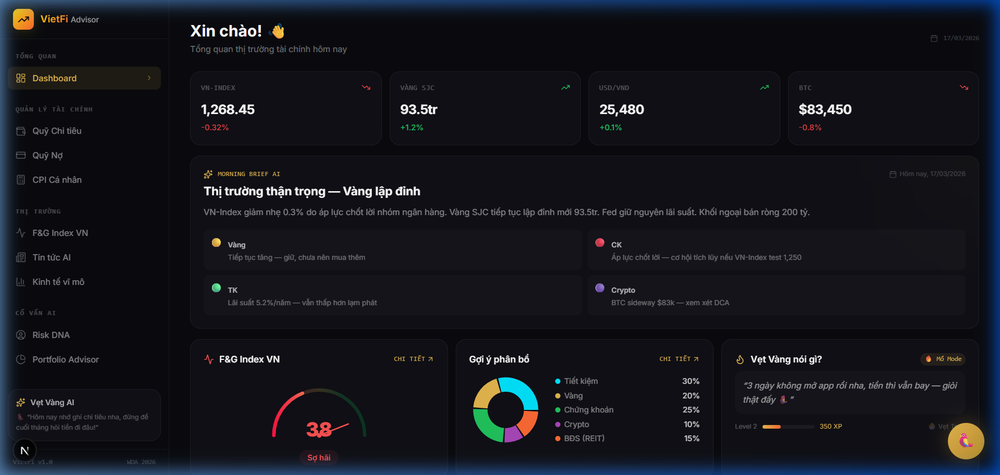
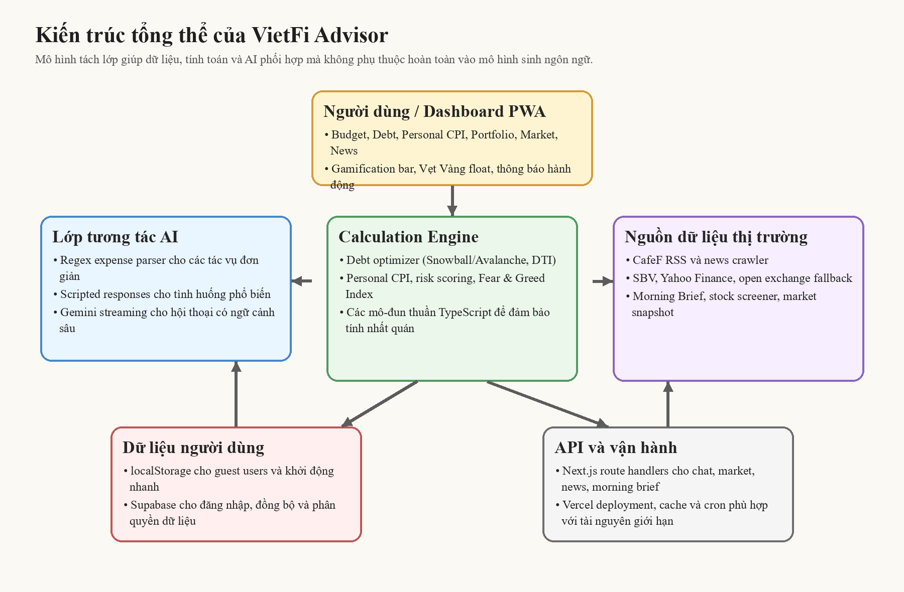
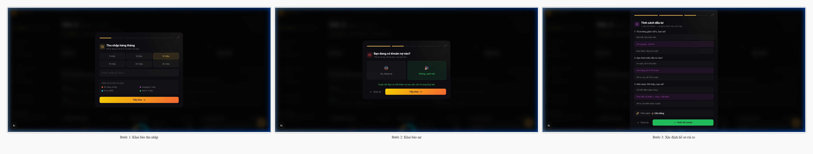

# Bộ Nội Dung Báo Cáo WDA2026 Cho VietFi Advisor

## TỔNG QUAN

### 1. Đặt vấn đề

Tài chính số tại Việt Nam đang tăng tốc rất nhanh, nhưng năng lực tự quản trị tài chính cá nhân của phần lớn người dùng vẫn tăng chậm hơn chính tốc độ số hóa đó. Ở tầng chính sách, Chính phủ đã xác định tài chính toàn diện là một định hướng quốc gia, nhấn mạnh cả hai mục tiêu: mở rộng khả năng tiếp cận dịch vụ tài chính và nâng cao hiểu biết tài chính cho người dân [2]. Ở tầng thị trường, Ngân hàng Nhà nước cho biết giá trị thanh toán không dùng tiền mặt trong năm 2024 đã vượt 295,2 triệu tỷ đồng, đồng thời tỷ lệ người từ 15 tuổi trở lên có tài khoản ngân hàng đạt 86,97% [1]. Cùng thời điểm, Tổng cục Thống kê ghi nhận CPI bình quân năm 2024 tăng 3,63% [3], còn Mobile Money đã vượt mốc 8,8 triệu người dùng [5]. Bức tranh đó cho thấy một thực tế rõ ràng: hạ tầng tài chính đã mở rộng, nhưng công cụ giúp người dùng nhìn thấy và điều phối toàn cảnh tài chính của chính mình vẫn còn thiếu.

Vấn đề không nằm ở việc người dùng thiếu dữ liệu, mà nằm ở chỗ dữ liệu bị chia cắt. Một người trẻ có thể tiêu tiền qua ví điện tử, vay qua thẻ tín dụng, mua trước trả sau trên sàn thương mại điện tử, tích lũy ở một ứng dụng đầu tư và đọc tin tức ở một nơi khác. Mỗi công cụ đều giải một phần của bài toán, nhưng không công cụ nào ghép các phần đó thành một quyết định thống nhất. Hệ quả là người dùng vẫn ra quyết định trong trạng thái “có vẻ hiểu”, nhưng thực chất thiếu bức tranh tổng thể về dòng tiền, nghĩa vụ nợ, sức mua và mức độ rủi ro của chính mình.

Đây chính là khoảng trống mà VietFi Advisor lựa chọn tấn công. Đề tài không bắt đầu từ câu hỏi “thêm được tính năng gì”, mà từ câu hỏi khó hơn: làm thế nào để một người dùng phổ thông nhìn tiền của mình rõ hơn, nhanh hơn và hành động tốt hơn trong bối cảnh Việt Nam.

### 2. Các giải pháp hiện có và hạn chế

Các giải pháp hiện có có thể chia thành bốn nhóm. Thứ nhất là các ứng dụng quản lý ngân sách quốc tế như Mint hay YNAB, mạnh ở ghi chép nhưng chưa phản ánh đủ ngữ cảnh Việt Nam như vàng SJC, VN-Index, USD/VND hay hành vi chi tiêu qua ví điện tử. Thứ hai là các nền tảng tài chính trong nước thiên về đầu tư hoặc tích lũy, giúp người dùng tiếp cận sản phẩm tài chính nhưng chưa giải quyết mạnh bài toán nợ phân mảnh và dòng tiền hằng ngày. Thứ ba là ứng dụng ngân hàng hoặc ví điện tử, vốn chỉ phản ánh dữ liệu trong hệ sinh thái riêng. Thứ tư là các công cụ thủ công như Excel hoặc Google Sheets, linh hoạt nhưng khó duy trì, dễ sai lệch và gần như không có lớp hỗ trợ ra quyết định.

Từ đó có thể thấy ba hạn chế lớn. Một là thiếu một trung tâm quản trị nợ tập trung để người dùng nhìn thấy toàn bộ nghĩa vụ tài chính trên cùng một mặt bàn. Hai là thiếu các chỉ số cá nhân hóa đủ sát bối cảnh Việt Nam, đặc biệt ở lạm phát, khẩu vị rủi ro và ưu tiên phân bổ vốn. Ba là thiếu một trải nghiệm đủ hấp dẫn để việc quản lý tài chính trở thành thói quen bền vững thay vì một tác vụ nặng nề. Nói ngắn gọn, thị trường có nhiều công cụ hữu ích, nhưng chưa có một sản phẩm vừa hiểu hành vi tài chính người Việt, vừa đủ thực dụng để giúp họ hành động mỗi ngày.

### 3. Phạm vi, đối tượng

Đề tài hướng tới nhóm người dùng Việt Nam thuộc Gen Z và Millennials, tức nhóm đã quen với smartphone, ví điện tử và dịch vụ tài chính số nhưng vẫn gặp khó khăn khi phải chuyển dữ liệu rời rạc thành quyết định tài chính rõ ràng. Nhóm mục tiêu trọng tâm là người dùng có thu nhập trung bình, nhiều khoản chi nhỏ phát sinh thường xuyên, có thể đang sử dụng thẻ tín dụng hoặc mua trước trả sau, đồng thời bắt đầu quan tâm đến tích lũy và đầu tư nhưng chưa có một “hệ điều hành tài chính cá nhân” đủ rõ.

Về phạm vi chức năng, VietFi Advisor tập trung vào bốn lớp giá trị cốt lõi: quản lý ngân sách và chi tiêu; hợp nhất và tối ưu trả nợ; cung cấp các chỉ số tài chính cá nhân như DTI, Personal CPI và hồ sơ rủi ro; kết hợp dữ liệu thị trường Việt Nam với lớp tương tác AI để tạo gợi ý hành động. Dự án không thay thế cố vấn đầu tư chuyên nghiệp và cũng không đóng vai trò như một hệ thống chấm điểm tín dụng chính thức; sản phẩm được định vị là một trợ lý tài chính cá nhân có khả năng giúp người dùng quan sát, hiểu và điều chỉnh hành vi tài chính của mình.

### 4. Mục tiêu

Mục tiêu tổng quát của VietFi Advisor là xây dựng một nền tảng tư vấn tài chính cá nhân cho người Việt, nơi quản trị nợ, chi tiêu, dữ liệu thị trường và AI không đứng riêng lẻ mà liên kết thành một logic hành động. Cụ thể, dự án hướng tới bốn đích đến: giúp người dùng nhìn thấy toàn cảnh tài chính trên một dashboard thống nhất; giúp họ hiểu áp lực tài chính qua các mô hình minh bạch như DTI, Snowball, Avalanche và Personal CPI; giúp họ đưa dữ liệu thị trường về đúng ngữ cảnh đời sống thay vì tiếp nhận thông tin vĩ mô theo kiểu rời rạc; và giúp họ duy trì thói quen quản lý tiền bằng một trải nghiệm đủ sống động, dễ quay lại và có tính phản hồi tức thời.

## Ý TƯỞNG DỰ ÁN

### 1. Mô tả dự án

VietFi Advisor là một ứng dụng web/PWA được thiết kế như một “bảng điều khiển tài chính cá nhân hợp nhất” cho người Việt. Điểm mạnh của sản phẩm không nằm ở việc nhồi nhiều tính năng tài chính vào cùng một giao diện, mà ở cách ghép các lớp giá trị thành một chuỗi hành động mạch lạc. Người dùng không chỉ ghi chi tiêu, mà nhìn thấy quỹ nào đang lệch. Người dùng không chỉ nhập khoản vay, mà nhìn thấy chiến lược thoát nợ nào phù hợp hơn. Người dùng không chỉ đọc dữ liệu thị trường, mà hiểu tín hiệu đó liên quan gì đến trạng thái tài chính của chính mình.

Ý tưởng cốt lõi của dự án là biến hỗn loạn tài chính cá nhân thành các quyết định rõ ràng. VietFi Advisor làm điều đó bằng ba lớp: lớp dữ liệu giúp người dùng nhìn thấy trạng thái hiện tại; lớp tính toán giúp giải thích trạng thái đó bằng các mô hình minh bạch; và lớp tương tác AI giúp chuyển các con số thành ngôn ngữ hành động. Chính cấu trúc này tạo ra tiềm năng của dự án: không chỉ là một công cụ ghi chép, mà là một sản phẩm có khả năng đồng hành và định hướng hành vi tài chính hằng ngày.

### 2. Các chức năng chính của hệ thống

#### 2.1. Dashboard tài chính hợp nhất

Dashboard là điểm vào trung tâm của VietFi Advisor. Tại đây, người dùng có thể quan sát đồng thời quỹ chi tiêu, tiến độ ngân sách, tín hiệu thị trường và trạng thái tương tác hằng ngày. Khác với nhiều ứng dụng tài chính chỉ trình bày số liệu, dashboard của VietFi Advisor được thiết kế như một lớp điều phối: nhìn vào là biết phần nào đang ổn, phần nào đang căng và phần nào cần hành động trước. Hình 1 minh họa giao diện tổng quan của hệ thống.

Điều làm dashboard này có tiềm năng không phải là số lượng widget, mà là khả năng gom nhiều quyết định đời thường lên cùng một mặt phẳng quan sát. Đó là khác biệt giữa “xem dữ liệu” và “thấy mình nên làm gì tiếp theo”.

#### 2.2. Debt Hub và tối ưu chiến lược trả nợ

Nếu dashboard là nơi nhìn bức tranh lớn, Debt Hub là nơi xử lý điểm đau tài chính cụ thể nhất. Mô-đun này cho phép người dùng theo dõi nhiều khoản nợ trên cùng một giao diện, quan sát số dư, lãi suất, kỳ hạn và áp lực thanh toán, sau đó mô phỏng chiến lược trả nợ theo Snowball và Avalanche. Từ một trạng thái nợ vốn mơ hồ và phân mảnh, hệ thống biến nó thành một bài toán có thể quan sát, so sánh và tối ưu.

Giá trị của Debt Hub nằm ở chỗ nó đánh thẳng vào “ảo giác nợ nhỏ”. Theo logic mental accounting, con người thường đánh giá thấp chi phí thực khi nghĩa vụ tài chính bị chia nhỏ thành nhiều khoản [6]. VietFi Advisor giải quyết điều đó bằng cách trực quan hóa tổng nghĩa vụ nợ và tác động của từng chiến lược trả nợ lên dòng tiền tương lai. Hình 2 minh họa mô-đun này.

#### 2.3. Personal CPI và AI Advisor theo ngữ cảnh Việt Nam

Một khác biệt quan trọng của VietFi Advisor là sản phẩm không dùng dữ liệu vĩ mô như một lớp thông tin “cho có”, mà biến nó thành công cụ đọc lại đời sống tài chính cá nhân. Personal CPI cho phép người dùng so sánh cảm nhận lạm phát của bản thân với CPI chính thức dựa trên chính cấu trúc chi tiêu của họ. Nhờ đó, người dùng hiểu vì sao cùng một mức lạm phát công bố nhưng sức ép lên từng người lại rất khác nhau.

Bên cạnh đó, hệ thống đánh giá khẩu vị rủi ro và hỗ trợ định hướng phân bổ tài chính theo logic của Prospect Theory [4]. Điều này giúp VietFi Advisor tránh rơi vào lối tư vấn chung chung. Hệ thống không trả lời kiểu “hãy đầu tư thông minh”, mà có cơ sở để nói rõ: với áp lực nợ hiện tại, cấu trúc chi tiêu hiện tại và mức chịu rủi ro hiện tại, người dùng nên ưu tiên việc gì trước. Chính lớp giải thích này khiến AI trong VietFi Advisor trở nên hữu ích, thay vì chỉ thú vị.

Bảng 1. Ánh xạ giữa vấn đề người dùng và mô-đun giá trị cốt lõi của VietFi Advisor (Nguồn: Tự tổng hợp)

| Vấn đề người dùng | Mô-đun giải pháp | Giá trị tạo ra |
| --- | --- | --- |
| Chi tiêu rời rạc, khó duy trì ghi chép | Dashboard ngân sách, nhập nhanh giao dịch, gamification | Giảm ma sát và tăng khả năng duy trì thói quen |
| Nợ phân mảnh, khó thấy tổng thể | Debt Hub, Debt Optimizer, DTI | Biến nợ thành bài toán có thể quan sát và ưu tiên |
| Cảm giác lạm phát không khớp dữ liệu công bố | Personal CPI | Cá nhân hóa tác động của lạm phát theo đời sống thực |
| Thiếu cơ sở để ra quyết định tài chính | AI Advisor, risk scoring, dữ liệu thị trường Việt Nam | Chuyển dữ liệu thành gợi ý hành động có ngữ cảnh |

#### 2.4. Kiến trúc hệ thống và luồng trải nghiệm

Về kiến trúc, VietFi Advisor được tổ chức thành các lớp rõ ràng: giao diện dashboard/PWA, lớp tương tác AI, lớp tính toán tài chính, lớp dữ liệu người dùng và lớp dữ liệu thị trường. Những thành phần đòi hỏi tính nhất quán cao như debt optimizer, Personal CPI hay risk scoring được triển khai dưới dạng mô-đun TypeScript thuần; AI chỉ được dùng cho phần diễn giải, đối thoại và tổng hợp nội dung. Đây là một lựa chọn kỹ thuật quan trọng vì nó giữ cho hệ thống vừa thông minh vừa kiểm soát được.

Song song với kiến trúc kỹ thuật, luồng onboarding cũng được xây dựng có chủ đích. Ngay từ lần đầu sử dụng, hệ thống hướng người dùng khai báo thu nhập, nợ và hồ sơ rủi ro để tạo nền cho các gợi ý tài chính về sau. Điều này biến VietFi Advisor từ một sản phẩm “mở ra rồi mới nghĩ xem làm gì” thành một sản phẩm biết dẫn dắt người dùng đi vào giá trị cốt lõi ngay từ những phút đầu tiên.

### 3. Công nghệ dự kiến sử dụng

VietFi Advisor lựa chọn Next.js 16 và React 19 làm nền tảng phát triển chính nhằm tận dụng App Router, khả năng tổ chức module và hiệu quả triển khai PWA. Ở lớp giao diện, Tailwind CSS v4 và Framer Motion hỗ trợ trải nghiệm hiện đại, đủ mượt để người dùng cảm nhận đây là một sản phẩm tiêu dùng thực thụ chứ không chỉ là một nguyên mẫu kỹ thuật. Ở lớp AI, Gemini 2.0 Flash được dùng cho hội thoại và tổng hợp ngữ cảnh, trong khi batch processing được áp dụng cho các tác vụ không đòi hỏi phản hồi tức thời nhằm tối ưu chi phí. Ở lớp lưu trữ, localStorage hỗ trợ người dùng khách khởi động nhanh, còn Supabase đáp ứng nhu cầu đồng bộ dài hạn. Toàn bộ tổ hợp công nghệ này phản ánh một lựa chọn thực dụng: đủ mới để tạo khác biệt, nhưng đủ gọn để đội thi có thể triển khai và kiểm soát.

### 4. Đánh giá tính khả thi

Điểm mạnh nhất của VietFi Advisor về tính khả thi là dự án không bắt đầu từ trang giấy trắng. Repo hiện tại đã có nhiều thành phần cốt lõi như debt optimizer, Personal CPI, risk scoring, news crawler, morning brief, stock screener, hybrid persistence và các route API liên quan đến dữ liệu thị trường cũng như tương tác AI. Điều đó có nghĩa là dự án không chỉ có ý tưởng hay, mà đã có một “xương sống kỹ thuật” đủ rõ để chứng minh logic vận hành.

Tính khả thi còn đến từ việc dự án được thiết kế đúng với ràng buộc hạ tầng. Với bối cảnh Vercel Hobby có giới hạn về cron và thời gian thực thi, VietFi Advisor ưu tiên client-side first, giữ AI ở đúng vai trò tạo giá trị, và tách riêng mô-đun tính toán khỏi phần sinh ngôn ngữ. Đây là lựa chọn có tính kỷ luật kỹ thuật. Nó cho phép sản phẩm vừa giàu trải nghiệm, vừa không lệ thuộc vào một kiến trúc tốn kém hoặc khó kiểm soát. Nói cách khác, tiềm năng của VietFi Advisor không nằm ở lời hứa quá lớn, mà ở chỗ mô hình giá trị của nó đã có nền kỹ thuật để đứng được trong thực tế.

## HƯỚNG PHÁT TRIỂN

Hướng phát triển thứ nhất của dự án là làm sâu thêm lớp dữ liệu Việt Nam, đặc biệt ở lãi suất huy động, dữ liệu bất động sản theo khu vực và các chỉ báo thị trường chuyên biệt hơn. Khi lớp dữ liệu này dày lên, phần tư vấn của hệ thống sẽ không chỉ đúng về logic, mà còn sắc hơn về ngữ cảnh. Hướng phát triển thứ hai là nâng cấp khả năng cá nhân hóa của AI Advisor thông qua hồ sơ tài chính động, trong đó hệ thống học dần từ cấu trúc chi tiêu, áp lực nợ và phản hồi thực tế của người dùng. Hướng phát triển thứ ba là củng cố chất lượng sản phẩm ở mức sẵn sàng triển khai, bao gồm kiểm thử end-to-end, tăng cường bảo mật dữ liệu cá nhân và hoàn thiện các cơ chế giám sát vận hành.

Nếu đi đúng ba trục này, VietFi Advisor có thể phát triển từ một sản phẩm thi đấu thành một nền tảng tài chính cá nhân có giá trị sử dụng thực sự. Lợi thế dài hạn của dự án không chỉ là “có AI”, mà là có khả năng đặt AI vào đúng chỗ, gắn với đúng dữ liệu và giải quyết đúng hành vi tài chính mà người Việt đang gặp mỗi ngày.

## TÀI LIỆU THAM KHẢO

### Tiếng Việt

[1] Ngân hàng Nhà nước Việt Nam, “Tạo thuận lợi cho người dân tiếp cận dịch vụ tài chính, thúc đẩy quá trình chuyển đổi số ngành Ngân hàng,” Aug. 25, 2025. [Online]. Available: https://www.sbv.gov.vn/vi/web/sbv_portal/w/t%E1%BA%A1o-thu%E1%BA%ADn-l%E1%BB%A3i-cho-ng%C6%B0%E1%BB%9Di-d%C3%A2n-ti%E1%BA%BFp-c%E1%BA%ADn-d%E1%BB%8Bch-v%E1%BB%A5-t%C3%A0i-ch%C3%ADnh-th%C3%BAc-%C4%91%E1%BA%A9y-qu%C3%A1-tr%C3%ACnh-chuy%E1%BB%83n-%C4%91%E1%BB%95i-s%E1%BB%91-ng%C3%A0nh-ng%C3%A2n-h-1. [Accessed: Mar. 27, 2026].

[2] Thủ tướng Chính phủ, “Quyết định số 149/QĐ-TTg về việc phê duyệt Chiến lược tài chính toàn diện quốc gia đến năm 2025, định hướng đến năm 2030,” Jan. 22, 2020. [Online]. Available: https://congbao.chinhphu.vn/van-ban/quyet-dinh-so-149-qd-ttg-30590.htm. [Accessed: Mar. 27, 2026].

[3] Tổng cục Thống kê, “Thông cáo báo chí giá tháng 12 năm 2024,” Jan. 2025. [Online]. Available: https://www.gso.gov.vn/wp-content/uploads/2025/01/Thong-cao-bao-chi-gia-thang-12.2024.pdf. [Accessed: Mar. 27, 2026].

### Tiếng Anh

[4] D. Kahneman and A. Tversky, “Prospect Theory: An Analysis of Decision under Risk,” *Econometrica*, vol. 47, no. 2, pp. 263-291, 1979.

[5] Ministry of Science and Technology of Vietnam, “Vietnam sees surge in mobile money adoption with 8.8 million users,” Jul. 12, 2024. [Online]. Available: https://english.mst.gov.vn/vietnam-sees-surge-in-mobile-money-adoption-with-88-million-users-197240712153444122.htm. [Accessed: Mar. 27, 2026].

[6] D. Prelec and G. Loewenstein, “The Red and the Black: Mental Accounting of Savings and Debt,” *Marketing Science*, vol. 17, no. 1, pp. 4-28, 1998.

## PHÂN CÔNG NHIỆM VỤ

Bảng 2. Phân công nhiệm vụ của nhóm phát triển VietFi Advisor (Nguồn: Tổng hợp từ AGENTS.md và kế hoạch làm việc nội bộ)

| STT | Thành viên | Vai trò và phần công việc |
| --- | --- | --- |
| 1 | Hoàng | Phụ trách data crawling, market APIs, news scraping, tăng cường bảo mật và tinh chỉnh giao diện người dùng. |
| 2 | Hưng | Phụ trách phát triển tính năng, business logic, các mô-đun tính toán, viết prompt và đối chiếu mức độ phù hợp của sản phẩm với yêu cầu WDA2026. |

Nhóm triển khai theo hướng phân tách phần việc theo lớp chuyên môn để giảm xung đột trong phát triển và tăng hiệu quả phối hợp. Hoàng tập trung vào dữ liệu, bảo mật và giao diện; Hưng tập trung vào logic nghiệp vụ, mô hình tính toán và định hướng AI. Cách phân công này giúp dự án giữ được cả tốc độ phát triển lẫn độ tập trung kỹ thuật ở các phần cốt lõi.
